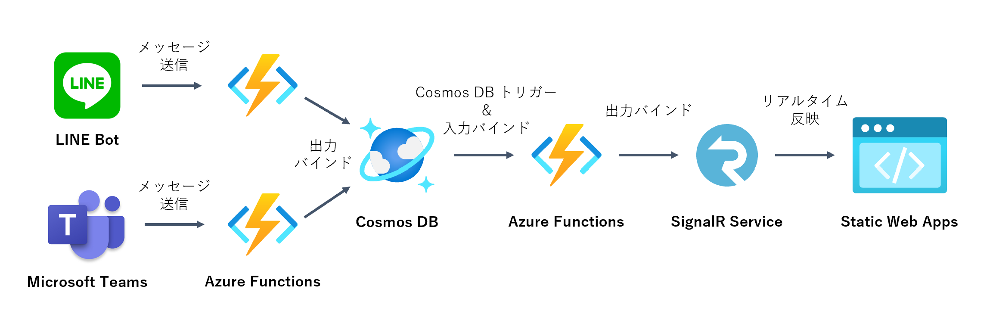

# Azure サーバーレステクノロジー体験ハンズオン ～イベント駆動でつなげよう～

## 概要
本リポジトリは、de:code 2020 のパーソナルスポンサーとして提供したハンズオン資料です（参加者の方への案内メールの記載と一部構成が異なります）。

LINE Bot または Teams 送信 Webhook の 2 種類のインターフェースからのアクションでリアルタイムに更新される Web ページを、Azure のサーバーレステクノロジーの組み合わせで構築します（2 種のインターフェースはどちらかだけでも実践可能です）。

LINE or Teams → Functions → Cosmos DB → Functions → SignalR Service → Static Web Apps リアルタイム更新のしくみを VS Code とその拡張機能を利用して開発します（言語は JavaScript です）。

## 本ハンズオンの狙い
Azure のサーバーレステクノロジーの利点と、それらがイベント駆動でつながっていく体験をしていただけます。

### 作成できるアプリ
簡易出退勤管理アプリです。在宅勤務などで、手軽に勤務時間を記録・報告したいという場面を想定しています。

LINE や Microsoft Teams といったチャットツールから勤怠報告メッセージを送信すると、名前とメッセージ、送信時刻をデータベースに記録し、それがリアルタイムに Web 画面に表示されます。

## 使用する Azure のサービス
- Azure Functions
- Azure Cosmos DB
- Azure SignalR Service
- Azure Static Web Apps (preview)

## 準備
### アカウント・サブスクリプション
- Azure アカウントと有効なサブスクリプション
- GitHub アカウント
- LINE アカウントもしくは Microsoft Teams（送信 Webhook の機能が利用できること）

### インストール
- Visual Studio Code (1.46.0 以上)
  - 拡張機能として以下をインストール
    - Azure Static Web Apps (Preview)
    - Azure Functions
    - Vetur
- Node.js (8.11.0 以上)
- Git

## もくじ
- chapter 1: [Cosmos DB アカウントの作成とコンテナーの追加](docs/chap1_cosmos_db.md)
- chapter 2: [SignalR Service の作成](docs/chap2_signalr_service.md)
- chapter 3: [Cosmos DB と SignalR Service をつなぐ Azure Functions の開発](docs/chap3_functions.md)
- chapter 4: [Static Web Apps 向けの SPA ＆ API の新規作成](docs/chap4_spa_and_api_for_static_web_apps.md)
- chapter 5a: [静的 Web サイトをリアルタイム更新するクライアントツールの開発（LINE Bot）](docs/chap5a_line_bot.md)
- chapter 5b: [静的 Web サイトをリアルタイム更新するクライアントツールの開発（Microsoft Teams の送信 Webhook）](docs/chap5b_teams_outgoing_webhook.md)
- chapter 6: [おわりに](docs/chap6_conclusion.md)

## 完成版コード
本リポジトリの [src](https://github.com/himanago/azure-serverless-event-driven-bot-hands-on/tree/master/src) フォルダ内を参考にしてください。

## ご意見・お問合せ

本リポジトリの [Issue](https://github.com/himanago/azure-serverless-event-driven-bot-hands-on/issues/new) または [Twitter (@himarin269)](https://twitter.com/himarin269) までお気軽にご連絡ください。

© 2020 Takumasa Hirabayashi All rights reserved.  
本コンテンツの著作権、および本コンテンツ中に出てくる商標権、団体名、ロゴ、製品、サービスなどはそれぞれ、各権利保有者に帰属します。
