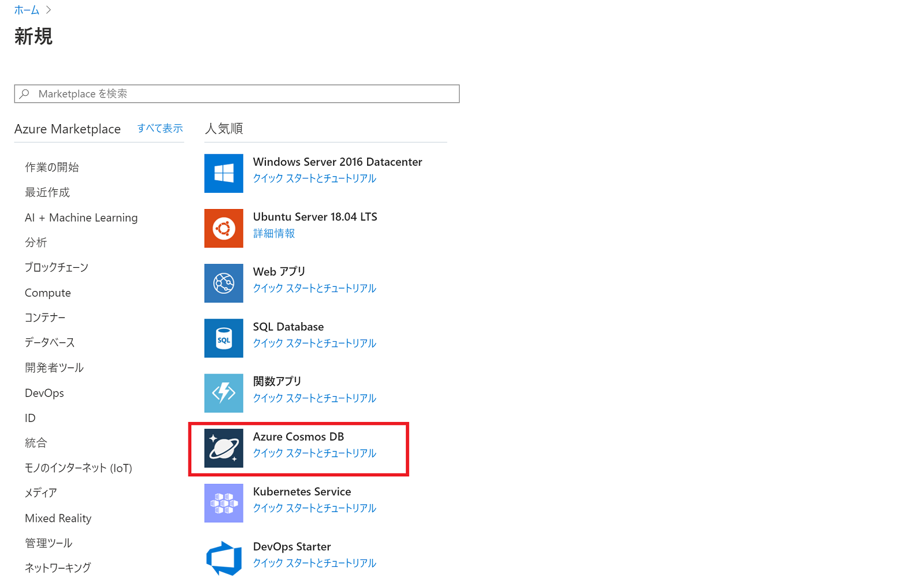

# chapter 1: Cosmos DB アカウントの作成とコンテナーの追加
## Azure Cosmos DB とは
Microsoft Azure の NoSQL データベースサービスです。

グローバルな分散データベースを簡単に構築できるほか、さまざまなデータ操作 API をサポートしています。

Free Tier（無料枠）が適用でき、小規模なものであれば無料で運用することも可能です。

[Azure Cosmos DB の概要 | Microsoft Docs](https://docs.microsoft.com/ja-jp/azure/cosmos-db/introduction)  
[Azure Cosmos DB での開発とテストのコストを最適化する | Microsoft Docs](https://docs.microsoft.com/ja-jp/azure/cosmos-db/optimize-dev-test#azure-cosmos-db-free-tier)

## Azure ポータルから Cosmos DB アカウントを作成する

[Azure ポータル](https://portal.azure.com/)にサインインし、左上のメニューから「リソースの作成」をクリックします。

Azure Cosmos DB を選択します。

「Azure Cosmos DB アカウントの作成」で以下のとおり内容を入力し「確認と作成」をクリックします。

- サブスクリプション: 有効なサブスクリプション
- リソースグループ: 新規作成から `time-card-rg` と入力
- アカウント名: 任意の名前
- API: コア (SQL)
- Notebooks (Preview): Off
- 場所: 任意のリージョンを選択
- Apply Free Tier Discount: Apply
- Account Type: Non-Production
- マルチ リージョン書き込み: 無効
- Availability Zones: 無効

※「Apply Free Tier Discount」は、サブスクリプション内ですでに適用している Cosmos DB アカウントがある場合、ここで適用することはできません。

内容を確認し、問題なければ「作成」をクリックします。

完了後、「リソースに移動」をクリックします。

## データベース、コンテナーの作成

Cosmos DB の画面に移動したら、左メニューの「概要」をクリックし、「Add Container」をクリックします。

以下のとおり入力し、「OK」をクリックします。

- Database id: Create new / `time-card-db`
- Provision database throughput: チェックを入れる
- Throughput: 400
- Container id: `timecard`
- Indexing: Automatic
- Partition key: `/userId`
- My partition key is larger than 100 bytes: チェックを入れない
- Analytical store: 何もしない
- Unique keys: 何もしない

これで、データベースとドキュメントを格納するコンテナーが作成されました。

[次へ: chapter 2: SignalR Service の作成](chap2_signalr_service.md)