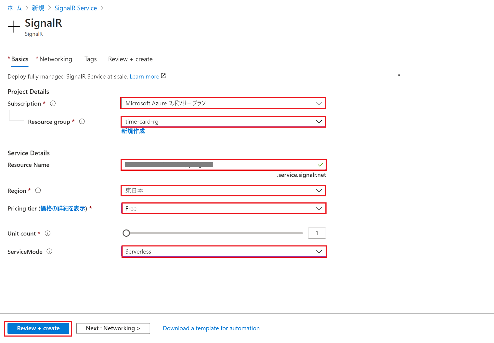

# chapter 2: SignalR Service の作成

## Azure SignalR Service とは
Azure SignalR Service は、クライアントをリアルタイム更新する WebSocket のためのサービスです。

WebSocket は、Web ページなどの更新をクライアント側の再取得操作に頼らずに、サーバー側のアクションを起点としてクライアント側の画面を更新できる技術です。

Azure Functions と組み合わせて使えば、簡単にサーバーレスでリアルタイムにクライアントに更新を通知できる機能を実現できます。

[Azure SignalR サービスとは | Microsoft Docs](https://docs.microsoft.com/ja-jp/azure/azure-signalr/signalr-overview)

## Azure ポータルから SignalR Service を作成する

[Azure ポータル](https://portal.azure.com/)の左上のメニューから「リソースの作成」をクリックします。

「SignalR」等で検索し、「SignalR Service」を選択します。

「作成」をクリック。

以下のように情報を入力し、「Review + create」をクリック。ServiceMode を「Serverless」にするのがポイントです（Azure Functions との統合に必要）。

- Subscription: 有効なサブスクリプション（Chapter 1 で選択したものと同じ）
- Resource group: Chapter 1 で作成したリソースグループ
- Resource Name: 任意の名前
- Region: 任意のリージョン
- Pricing tier: Free
- Unit count: 1
- ServiceMode: Serverless

内容を確認し、問題なければ「Create」をクリック。

[次へ: chapter 3: Cosmos DB と SignalR Service をつなぐ Azure Functions の開発](chap3_functions.md)
