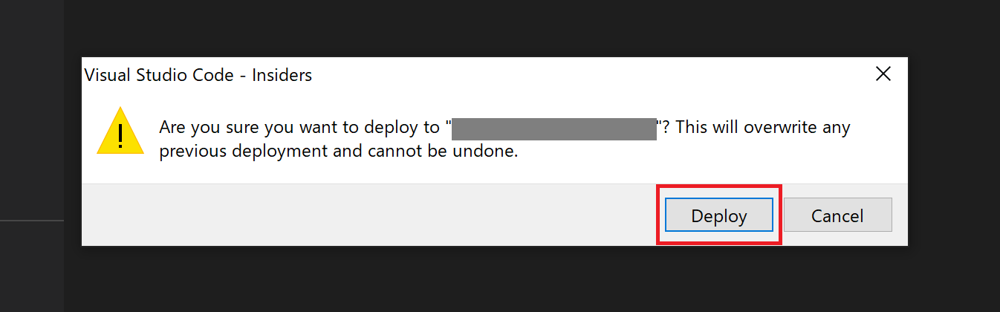
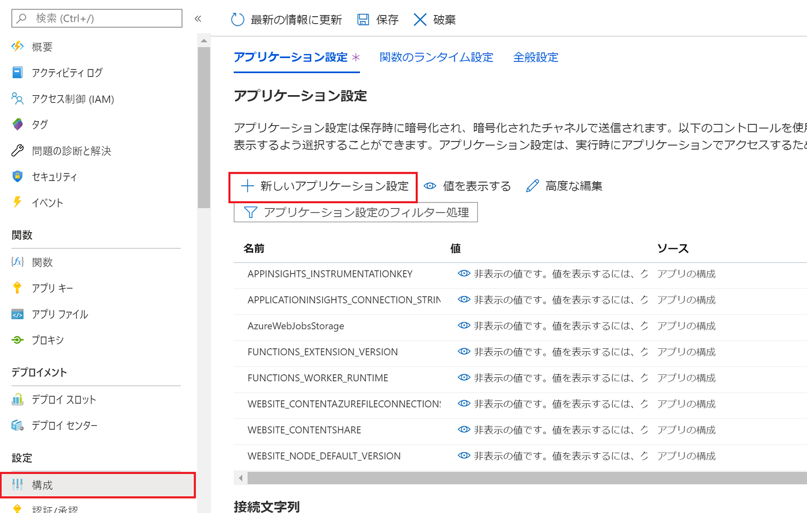

# chapter3: Cosmos DB と SignalR Service をつなぐ Azure Functions の開発

## Cosmos DB の　Change Feed と SignalR をつなぐ
Cosmos DB には、データの変更を順番に記録・通知してくれる Change Feed と呼ばれる機能をサポートしています。

この変更を起点に Azure Functions を起動する「Cosmos DB トリガー」と、SignalR Service による WebSocket を組み合わせることで、DB の変更をリアルタイムに Web ページに反映・表示させることができます。

[Azure Cosmos DB の変更フィード | Microsoft Docs](https://docs.microsoft.com/ja-jp/azure/cosmos-db/change-feed)

## Azure ポータルから Function App の作成

[Azure ポータル](https://portal.azure.com/)の左上のメニューから「リソースの作成」をクリックし、関数アプリを選択します。

※ VS Code の拡張機能を使って Azure にリソースを作成することもできますが、リソースグループの指定など細かい設定ができないため、あらかじめポータルから作っておきます。


以下の情報を入力し、「確認と作成」をクリック。

- サブスクリプション: Cosmos DB、SignalR と同様
- リソースグループ: 同上
- 関数アプリ名: 任意の名前
- 公開: コード
- ランタイムスタック: Node.js
- バージョン: 12
- 地域: 任意のリージョン


確認して問題なければ「作成」をクリックします。

## VS Code での開発
### 準備
今回作成するアプリのソースコード（フロントエンド、バックエンドとも）を格納するフォルダを任意の場所に作成しておきます（ここでは `time-card-static-web` というフォルダを作成しました）。

その中に、関数を作成するためのフォルダを用意し（ここでは `functionApp`）、それを VS Code（Insiders）で開きます。

### プロジェクト作成
左メニューの Azure アイコンから拡張機能のメニューを開き、「FUNCTIONS」の「Create New Project...」をクリックします。


functionApp を選択。


言語は JavaScript を選択。


「Azure Cosmos DB trigger」を選択。


関数名として、`signalChangeFeed` を入力。


設定の保存先として「AzureWebJobsStorage」をクリック。


変更の監視対象となるデータベース名（Chapter 1 で作成したもの。ここでは `time-card-db`）を入力。


変更の監視対象となるコンテナー名（Chapter 1 で作成したもの。ここでは `timecard`）を入力。


変更履歴を格納するためのコンテナー名として `leases` を入力。


「true」を選択。これにより、`leases`　コンテナーが自動で作成されます。


最後に Enter を押すと、プロジェクトが作成されます。

### コードの編集

作成された関数コードを編集していきます。

以下のように、トリガーやバインドの情報を定義するための `function.json` を編集し、SignalR Service への出力バインディングを追記します。

```json
{
  "bindings": [
    {
      "type": "cosmosDBTrigger",
      "name": "documents",
      "direction": "in",
      "leaseCollectionName": "leases",
      "connectionStringSetting": "CosmosDBConnectionString",
      "databaseName": "time-card-db",
      "collectionName": "timecard",
      "createLeaseCollectionIfNotExists": true
    },
    {
      "type": "signalR",
      "name": "signalRMessages",
      "hubName": "timecard",
      "connectionStringSetting": "SignalRConnectionString",
      "direction": "out"
    }
  ]
}
```

関数本体のコードである `index.js` は以下のように変更します。

```js
module.exports = async function (context, documents) {
    context.bindings.signalRMessages = [{
        "target": "newData",
        "arguments": documents
    }];
};
```

入力・出力の設定を行っておくと、コード本体はこのようにとてもシンプルに書くことができます。


## Azure へのデプロイ
左メニューの Azure アイコンから、拡張機能を使って Azure にデプロイすることができます。

「Deploy to Function App...」をクリックします。


Azure へサインインしていなければサインインを促されます。

「Sign in to Azure...」をクリック。


ブラウザが開き、サインインページが表示されるのでサインインを行います。その後 VS Code に戻ると、サインインされています（サブスクリプションが複数ある場合サブスクリプションを選択）。

続いて、さきほど作成した関数アプリを選択すると確認ダイアログが表示され、「Deploy」をクリックするとデプロイが開始されます。




## 環境変数の設定
再度ポータルから Function App（関数アプリ）を確認します。

「関数」を開くとローカルで開発した関数がデプロイされているのを確認できます。


「構成」から、「新しいアプリケーション設定」をクリックすると、接続文字列などの情報を設定できます。




Azure ポータルで、それぞれの接続文字列をコピーし、その値をここで設定します。

Cosmos DB は「キー」にある「プライマリ接続文字列」をコピーし、その値を `CosmosDBConnectionString` をキーとして設定します。

SignalR Service は「Keys」にある「CONNECTION STRING」をコピーし、その値を `SignalRConnectionString` をキーとして設定します。


2 つ設定したら、「保存」を押します。

※ `function.json` で設定した接続文字列用のキー名と一致させておく必要があります。


以上で設定は完了です。


[次へ: chapter 4: Static Web Apps 向けの SPA ＆ API の新規作成](chap4_spa_and_api_for_static_web_apps.md)
