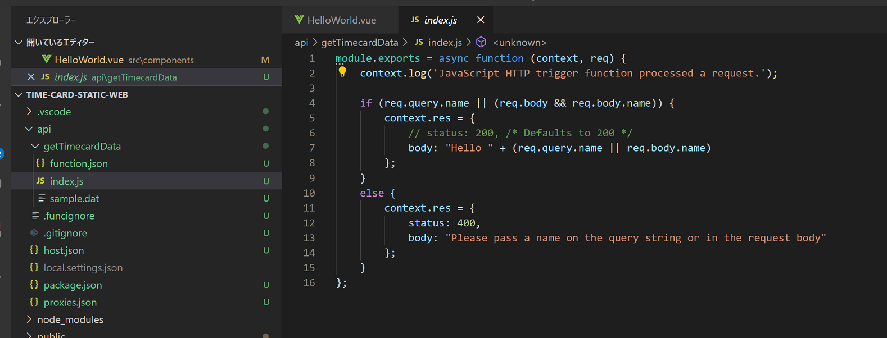
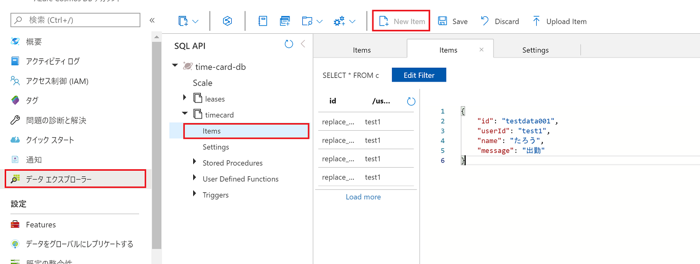
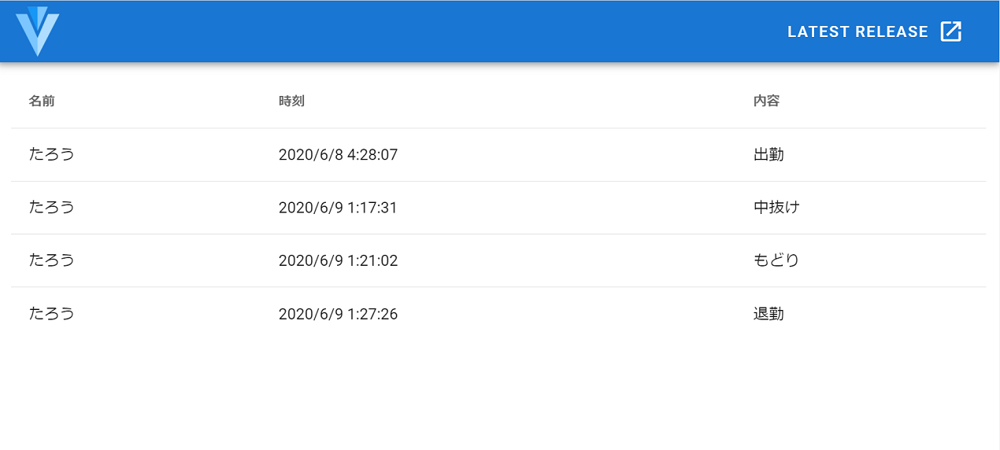

# chapter 4: Static Web Apps 向けの SPA ＆ API の新規作成

## Azure Static Web Apps とは

Azure Static Web Apps は、GitHub リポジトリから Azure に静的な Web アプリをデプロイできるサービスです（現在プレビュー）。

Angular, React や Vue.js などで開発した静的な Web サイトを簡単にホストでき、Azure Functions（現在 Node.js のみ）のバックエンドを統合することも可能です。

[Azure Static Web Apps とは | Microsoft Docs](https://docs.microsoft.com/ja-jp/azure/static-web-apps/overview)


## 準備
### Vue.js プロジェクトの作成
今回のアプリ開発用のフォルダ（ここでは `time-card-static-web`。functionApp の親）を VS Code（Insiders）で開きます。

#### Vue CLI の導入
VS Code でターミナルを開いて以下のコマンドを実行し、Vue CLI の確認をします。

```bash
vue --version
```
@vue/cli 4.4.1 など表示されれば OK です。

コマンドの実行に失敗した場合は以下のコマンドで Vue CLI をインストールします。

```bash
npm install -g @vue/cli
```

#### Vue.js プロジェクトの作成

以下のコマンドを実行し、

```bash
vue create client
```

```bash
? Generate project in current directory? (Y/n) Y
```

`default (babel, eslint)` のまま Enter を押します。

```bash
? Please pick a preset: (Use arrow keys)
> default (babel, eslint)
  Manually select features
```

初期化が完了したら、

```bash
cd client
npm run serve
```

を実行し、http://localhost:8080/ にアクセスします。

ブラウザに以下のような画面が表示されれば成功です。


#### Vuetify の導入

Vuetify を使用するので、インストールします。
Ctrl + c で 止め、以下のコマンドを実行します（カレントディレクトリが `client` であることを確認）。

```bash
vue add vuetify
```

Default のまま Enter。

```bash
? Choose a preset: (Use arrow keys)
> Default (recommended)
  Prototype (rapid development)
  Configure (advanced)
```

完了後、再度

```bash
npm run serve
```

を実行し、http://localhost:8080/ を表示すると、Vuetify の初期画面に変わります。


### タイムカード画面の開発
#### フロントエンド

SignaR 用のライブラリを導入します。

```bash
npm install @aspnet/signalr --save
```

src/components/HelloWorld.vue を以下のコードで置き換えます。

```html
<template>
  <v-container>
    <v-simple-table>
      <template v-slot:default>
        <thead>
          <tr>
            <th class="text-left">名前</th>
            <th class="text-left">時刻</th>
            <th class="text-left">内容</th>
          </tr>
        </thead>
        <tbody>
          <tr v-for="item in timecardData" :key="item.name">
            <td>{{ item.name }}</td>
            <td>{{ dateToString(item._ts) }}</td>
            <td>{{ item.message }}</td>
          </tr>
        </tbody>
      </template>
    </v-simple-table>
  </v-container>
</template>

<script>
  export default {
    name: 'HelloWorld',
    data: () => ({
      timecardData: []
    }),
    created: async function() {
      const now = new Date();
      const begin = Date.UTC(now.getFullYear(), now.getMonth(), 1) / 1000;
      const end = Date.UTC(now.getFullYear(), now.getMonth() + 1, 1) / 1000;
      const res = await fetch(`/api/getTimecardData/${begin}/${end}`);
      if (res.ok) {
        this.timecardData = await res.json();
      }

      // SignalR
      const connection = new signalR.HubConnectionBuilder()
        .withUrl('/api')
        .configureLogging(signalR.LogLevel.Information)
        .build();

      connection.on('newData', async (message) => {
        this.timecardData.push(message);
      });

      connection.onclose(async () => {
        await start();
      });

      this.start();
    },
    methods: {
      dateToString: function(unixtime) {
        const date = new Date(unixtime * 1000);
        return `${date.toLocaleDateString()} ${date.toLocaleTimeString()}`; 
      },
      start: async function() {
        try {
          await connection.start();
          console.log("connected");
        } catch (err) {
          console.log(err);
          setTimeout(() => start(), 5000);
        }
      }
    }
  }
</script>

```

#### バックエンド

Static Web Apps の拡張機能から、バックエンド関数を作成します。

バックエンドは、Azure Functions の関数として作成され、Static Web Apps でまとめて開発・管理・デプロイされます。

ここで作成する関数は以下の 2 つ。

|関数名|用途|トリガー|
|----|----|----|
|getTimecardData|DBから過去のタイムカードのデータを取得する|HTTP|
|negotiate|SignalR Service の接続情報を取得する|HTTP|

拡張機能を使い、関数を作成していきます。上記 2 つ分実施します。

以下の稲妻にプラス記号のついたアイコンをクリックします。


関数名を入力し Enter を押します。


言語は JavaScript を選択します。


api フォルダ内に、関数の雛形が作成されます。




##### getTimecardData
`function.json` のコードを以下のものに置き換えます。

```json
{
  "bindings": [
    {
      "authLevel": "function",
      "type": "httpTrigger",
      "direction": "in",
      "name": "req",
      "methods": [
        "get"
      ],
      "route":"getTimecardData/{begin}/{end}"
    },
    {
      "type": "http",
      "direction": "out",
      "name": "res"
    },
    {
      "name": "documents",
      "type": "cosmosDB",
      "databaseName": "time-card-db",
      "collectionName": "timecard",
      "sqlQuery": "SELECT * from c WHERE c._ts >= {begin} AND c._ts < {end}",
      "connectionStringSetting": "CosmosDBConnectionString",
      "direction": "in"
    }
  ]
}
```

`index.js` のコードを以下のものに置き換えます。

```js
module.exports = async function (context, req) {
    context.res = {
        body: context.bindings.documents,
        headers: { 'Content-Type': 'application/json' }
    };
};
```

`sample.dat` は不要なので削除します。

入力バインディングの設定で `context.bindings.documents` に当月分の全ドキュメントが入ってきています（`bindings` の `route` で設定したとおりに呼び出し URL で日付の範囲のパラメータを受け取り、それを使って `sqlQuery` を実行した結果です）。


##### negotiate

`function.json` のコードを以下のものに置き換えます。

```json
{
  "bindings": [
    {
      "authLevel": "anonymous",
      "type": "httpTrigger",
      "direction": "in",
      "name": "req",
      "methods": [
        "get"
      ]
    },
    {
      "type": "signalRConnectionInfo",
      "name": "connectionInfo",
      "hubName": "timecard",
      "connectionStringSetting": "SignalRConnectionString",
      "direction": "in"
    }
  ]
}
```

`index.js` のコードを以下のものに置き換えます。

```js
module.exports = async function (context, req, connectionInfo) {
    context.res.body = connectionInfo;
};
```


こちらも、`sample.dat` は不要なので削除します。

### GitHub へのリポジトリ作成とプロジェクトの Push

ブラウザから GitHub にサインインし、空のリポジトリを[新規作成](https://github.com/new)します。


Public / Private いずれでも OK です。

できあがったら、アイコンをクリックして URL をコピーします。


Ctrl + Shift + p または F1 キーでコマンドパレットを開き、`git add remote` などと入力しリモート追加をします。


コピーしていた URL を指定し、リモート名は `origin` とします。

再びコマンドパレットを開き、`git commit` などと入力しコミット。


「はい」をクリック。


コミットメッセージを入力。


コマンドパレットを開き `git push` などと入力しプッシュ。


「はい」をクリック。


※ リポジトリを Private にした場合はここで認証情報を聞かれます。

これで GitHub にソースコードが登録されました。


### VS Code から
「Azure Static Web Apps (Preview)」の拡張機能をインストールした VS Code（Insiders）からプロジェクトを作成します。


Azure にサインインしていなければ、サインインを促されるので、「Sign in to Azure...」を選択します。


ブラウザにリダイレクトされるので、有効な Azure サブスクリプションのあるアカウントでサインインします。

リソースを作成したいサブスクリプションを選びます。


続いて、GitHub にサインインします（VS Code でまだサインインされていない場合のみ）。


Continue をクリック。


Authorize github をクリック。


サインインに成功すると、リソース名が入力できるようになります。


続けてGitHub の組織、リポジトリを選択します。さきほど作成したリポジトリを選択しましょう。

master ブランチを選択。


Web サイトのフロントエンドのフォルダ（`client`）を指定。


バックエンドのフォルダ（`api`）を指定。


フロントエンドをビルドしたものが格納されるフォルダ名を指定（`dist` 固定）。


任意のリージョンを指定。


設定が完了し、GitHub から自動ビルド・デプロイが開始されます。

## 環境変数の設定

作成されたリソースが、同名のリソースグループの中に作られているので開きます。

「構成」を開きアプリケーション設定を追加していきます。Chapter 3 と同様です。


設定する値も Chapter 3 と同様で、

- CosmosDBConnectionString
  - Cosmos DB の「キー」にある「プライマリ接続文字列」
- SignalRConnectionString
  - SignalR Service の「Keys」にある「CONNECTION STRING」

の 2 つです。


設定後、「保存」を押します。

## 表示確認
Cosmos DB にデータを入れ、それが Web サイトに反映されるか確認します。

「概要」に URL が表示されているのでアクセスします。


Web ページを開いた状態で、Cosmos DB にデータを入れていきます。Cosmos DB の「データエクスプローラー」を表示し、`timecard`　の「New Item」から以下のデータを保存します（「Save」で保存）。

```json
{
    "id": "testdata001",
    "userId": "test1",
    "name": "たろう",
    "message": "出勤"
}
```




画面に登録したデータが更新なしで表示され（WebSocket による自動更新）、またその後更新しても表示されていれば（初期表示時のデータ取得）成功です。

いくつかデータを追加登録してみましょう。




それでは、チャットベースで簡単にデータを登録するための入力インターフェースを作ってみましょう。


次へ: 静的 Web サイトをリアルタイム更新するクライアントツールの開発

（以下のいずれかまたは両方を実践してみてください）
- [chapter 5a: LINE Bot](chap5a_line_bot.md)
- [chapter 5b: Microsoft Teams の送信 Webhook](chap5b_teams_outgoing_webhook.md)
