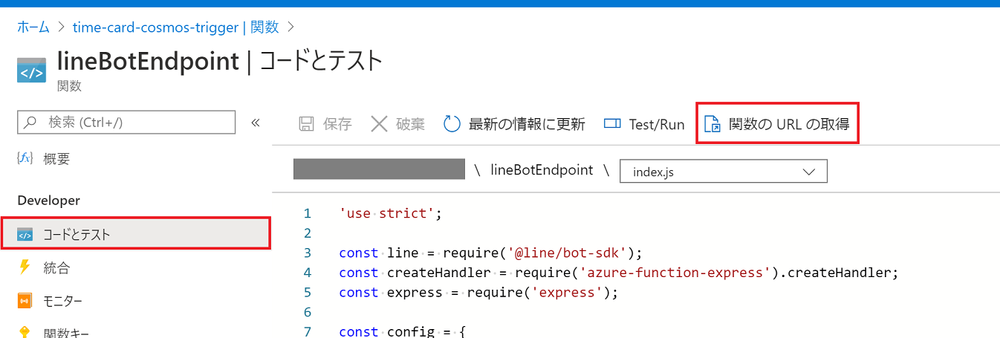
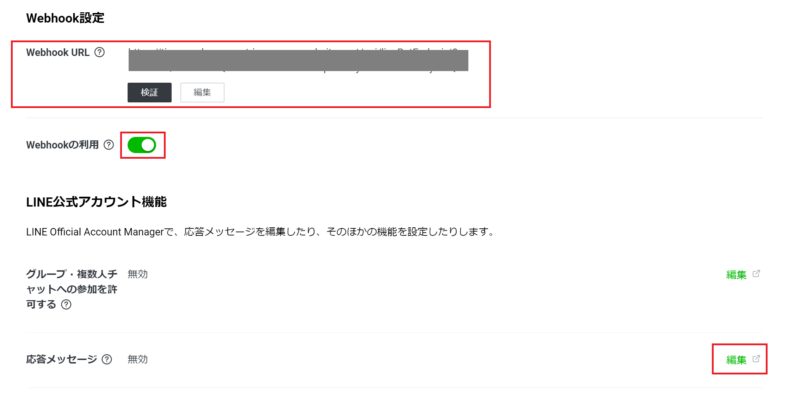
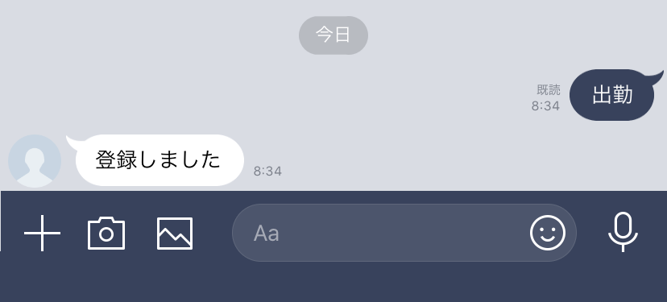
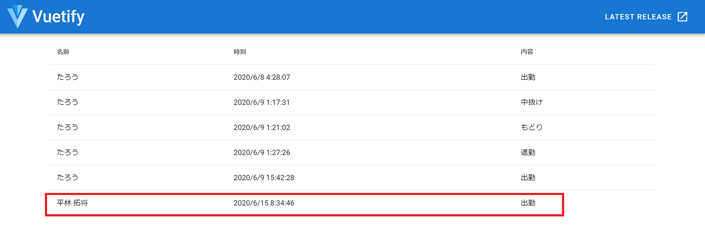

# chapter 5a: 静的 Web サイトをリアルタイム更新するクライアントツールの開発（LINE Bot）

## LINE Bot とは

友だち追加することでさまざまな機能を利用できる LINE 公式アカウントのチャットボット機能で、「Messaging API」を使って Webhook によるユーザーからのメッセージに対応する機能を実装できます。

[Messaging APIの概要](https://developers.line.biz/ja/docs/messaging-api/overview/)

## functionApp への Function 追加
LINE Bot のバックエンド処理を作成していきます。
Static Web App のバックエンドではないため、実装は `functionApp` フォルダに関数を追加していきます。

### 関数の追加
VS Code で `functionApp` フォルダを開き、Chapter 3 の要領で関数を追加します。

- トリガー： HTTP Trigger
- 関数名: `lineBotEndpoint`
- 承認レベル: Function

### npm install

必要なパッケージをインストールします。ターミナルから、以下のコマンドを実行します（カレントディレクトリが `functionApp` であることを確認すること）。

```bash
npm install @line/bot-sdk --save
npm install azure-function-express --save
npm install express --save
```

### コードの変更

`function.json` を以下のコードに置き換えます。

```json
{
  "bindings": [
    {
      "authLevel": "function",
      "type": "httpTrigger",
      "direction": "in",
      "name": "req",
      "methods": [
        "post"
      ],
    },
    {
      "type": "http",
      "direction": "out",
      "name": "res"
    },
    {
      "name": "document",
      "type": "cosmosDB",
      "databaseName": "time-card-db",
      "collectionName": "timecard",
      "connectionStringSetting": "CosmosDBConnectionString",
      "direction": "out"
    }
  ]
}
```

`index.js` を以下のコードに置き換えます。

```js
'use strict';

const line = require('@line/bot-sdk');
const createHandler = require('azure-function-express').createHandler;
const express = require('express');

const config = {
    channelAccessToken: process.env.CHANNEL_ACCESS_TOKEN,
    channelSecret: process.env.CHANNEL_SECRET,
};

const client = new line.Client(config);

const app = express();

app.post('/api/lineBotEndpoint',
    line.middleware(config),
    (req, res) => {
        Promise
            .all(req.body.events.map(ev => handleEvent(ev, req.context)))
            .then((result) => res.json(result))
            .catch((err) => {
                console.error(err);
                res.status(500).end();
            });
    }
);

function handleEvent(event, context) {
    // テキストメッセージ以外は無視
    if (event.type !== 'message' || event.message.type !== 'text') {
        return Promise.resolve(null);
    }

    // 氏名を取得
    client.getProfile(event.source.userId).then(p => {
        // 出力バインディング
        context.bindings.document = JSON.stringify({
            id: new Date().getTime().toString(16) + event.source.userId,
            userId: event.source.userId,
            name: p.displayName,
            message: event.message.text
        });
    });

    // 返信
    return client.replyMessage(
        event.replyToken, { type: 'text', text: '登録しました' });
}

module.exports = createHandler(app);
```

処理の流れは

- リクエストの検証
- メッセージのパース
- Cosmos DB への書き込み
- 結果の返信処理

です。


完成したら、拡張機能からデプロイを行います。


## LINE Developers へのチャネル作成
### チャネルの作成
「[Messaging APIを利用するには](https://developers.line.biz/ja/docs/messaging-api/getting-started/)」を参考に、LINE Ddevelopers から Messaging API チャネルを作成します。

### Webhook URL の設定
作成されたチャネルのアカウントを友だち追加します。

関数 URL を設定します。

Azure ポータルから Function App を開き、「関数」「lineBotEndpoint」「コードとテスト」と進み、「関数の URL の取得」をクリックします。




関数 URL がコピーできるので、LINE Developers の「Messaging API設定」タブから、「Weebhook設定」を行います。

また、自動応答メッセージは無効にします。「編集」から Official Account Manager に遷移すると設定できます。

※ Webhook 設定は Official Account Manager からも設定可能です。




### 環境変数への設定
Azure 側に LINE の情報を設定します。

ポータルから、Function App の「構成」を開き、「アプリケーション設定」に、作成した Messaging API チャネルのチャネルアクセストークン（キー名は `CHANNEL_ACCESS_TOKEN`）、チャネルシークレット（キー名は `CHANNEL_SECRET`）を登録します。

## 動作確認
Web 画面を開き、友だち登録した Bot にメッセージを送ってみましょう。



画面に自分の名前と時刻、送信したメッセージが表示されれば成功です。



うまく画面表示されたら成功です。


## 終わったら

- [chapter 5b: Microsoft Teams の送信 Webhook](chap5b_teams_outgoing_webhook.md)
- [chapter 6: おわりに](chap6_conclusion.md)
