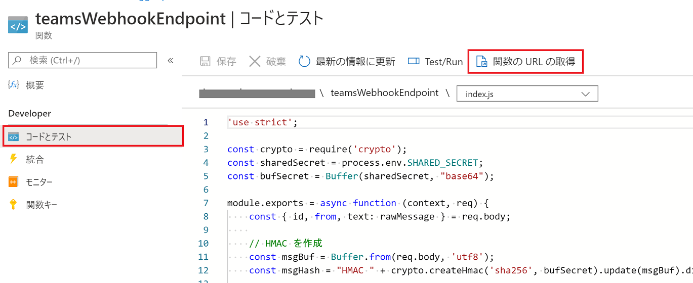
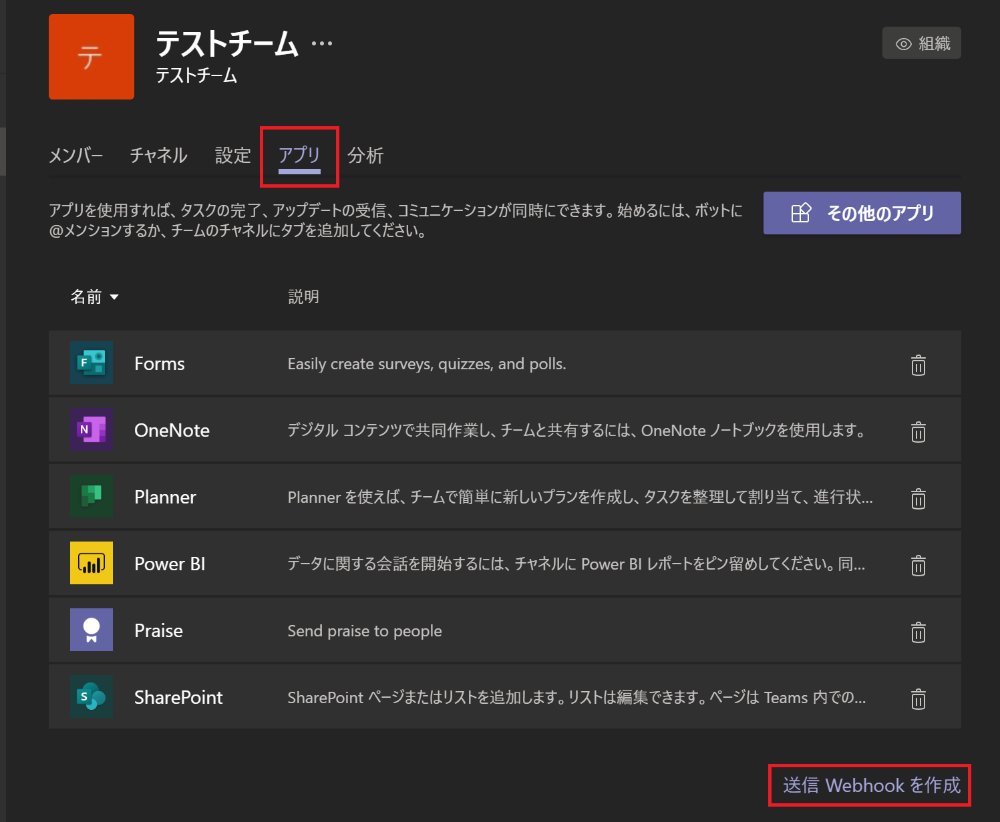
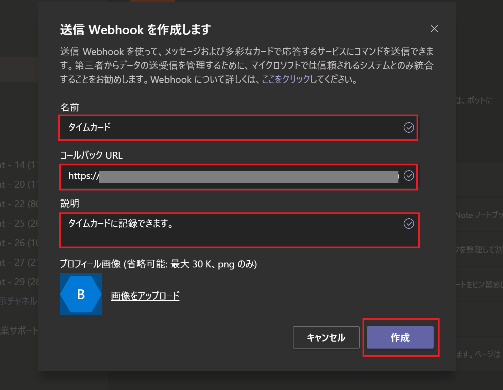
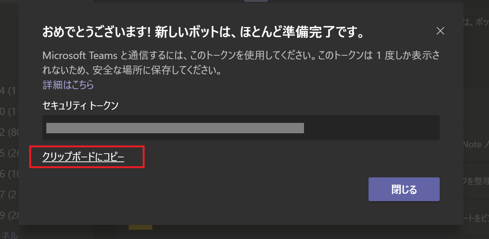
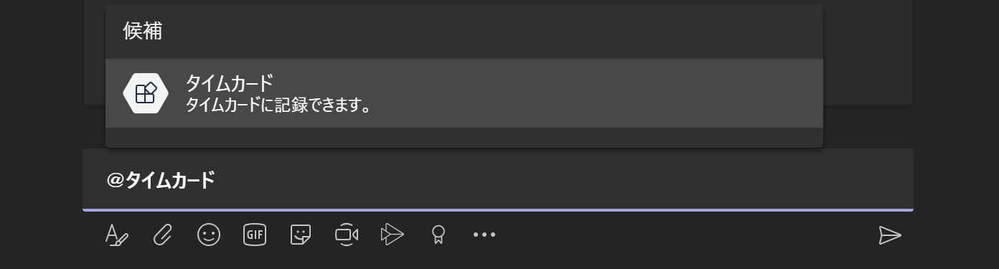
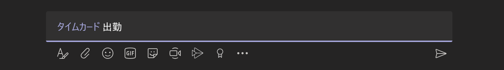

# chapter 5b: 静的 Web サイトをリアルタイム更新するクライアントツールの開発（Microsoft Teams の送信 Webhook）

## Teams 送信 Webhook とは

Teams から外部のサービスへメッセージ連携できる簡易拡張機能で、＠メンションを利用して簡単にメッセージを送信することができます。

[送信 Webhook を使用して Microsoft Teams にカスタム ボットを追加する](https://docs.microsoft.com/ja-jp/microsoftteams/platform/webhooks-and-connectors/how-to/add-outgoing-webhook)

## functionApp への Function 追加

### 関数の追加
VS Code で `functionApp` フォルダを開き、Chapter 3 の要領で関数を追加します。

- トリガー： HTTP Trigger
- 関数名: `teamsWebhookEndpoint`
- 承認レベル: Function

### npm install

必要なパッケージをインストールします。ターミナルから、以下のコマンドを実行します（カレントディレクトリが `functionApp` であることを確認すること）。

```bash
npm install crypto --save
```

### コード
`function.json` を以下のコードに置き換えます。

```json
{
  "bindings": [
    {
      "authLevel": "function",
      "type": "httpTrigger",
      "direction": "in",
      "name": "req",
      "methods": [
        "post"
      ]
    },
    {
      "type": "http",
      "direction": "out",
      "name": "res"
    },
    {
      "name": "document",
      "type": "cosmosDB",
      "databaseName": "time-card-db",
      "collectionName": "timecard",
      "connectionStringSetting": "CosmosDBConnectionString",
      "direction": "out"
    }
  ]
}
```


```js
'use strict';

const crypto = require('crypto');
const sharedSecret = process.env.SHARED_SECRET;
const bufSecret = Buffer(sharedSecret, "base64");

module.exports = async function (context, req) {
    const { id, from, text: rawMessage } = req.body;
    
    // HMAC を作成
    const msgBuf = Buffer.from(JSON.stringify(req.body), 'utf8');
    const msgHash = "HMAC " + crypto.createHmac('sha256', bufSecret).update(msgBuf).digest("base64");

    // HMAC とヘッダーの authorization が一致しない場合エラー
    if (msgHash !== req.headers['authorization']) {
        context.error('認証に失敗しました。');
        return;
    }

    // 「<at>タイムカード</at> メッセージ内容」という形式なのでメッセージのみ切り出す
    const message = rawMessage.substr(rawMessage.indexOf('</at>') + '</at>'.length).replace('&nbsp;', ' ').trim();

    // 出力バインディング
    context.bindings.document = JSON.stringify({
        id: id,
        userId: from.id,
        name: from.name,
        message: message
    });

    // 返信
    context.res.json({
        "type": "message",
        "text": "登録しました。"
    });
};
```


完成したら、拡張機能からデプロイを行います。

## Teams での送信 Webhook コマンド作成

### Teams から作成
Teams から、Webhook 送信機能を有効化し、関数 URL を登録します。

Azure ポータルから Function App を開き、「関数」「teamsWebhookEndpoint」「コードとテスト」と進み、「関数の URL の取得」をクリックし、URL をコピーします。



Teams の、Webhook 機能を使いたいチームの「チームの管理」から「アプリ」を開き、右下の「送信 Weebhook を作成」をクリックします。




名前、コールバック URL（コピーした関数 URL）、説明を入力します。




セキュリティトークンが表示されるので、コピーしておきます（再表示できないので注意）。




### 環境変数の追加

ポータルから Function App の「構成」を開き、「アプリケーション設定」にコピーしたセキュリティトークンを追加します（キー名は `SHARED_SECRET`）。


以上で完成です。

## 動作確認

Web 画面を開いた状態で、Teams から「＠タイムカード」でメンションします。



「出勤」など勤怠メッセージを入れ、送信します。



メッセージを送信すると返信があり、Web 画面に反映されます。


うまく画面表示されたら成功です。

次へ: 

- [chapter 5a: LINE Bot](chap5a_line_bot.md)
- [chapter 6: おわりに](chap6_conclusion.md)
